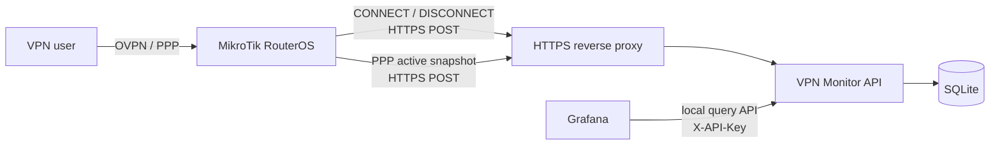

# MikroTik VPN Monitor

MikroTik VPN Monitor is a lightweight monitoring service for centralizing authenticated VPN session activity from MikroTik RouterOS and exposing it to local observability tools such as Grafana.

The project is designed around two complementary data sources:

- **PPP lifecycle events** (`on-up` / `on-down`) for durable connection history;
- **PPP active-session snapshots** for reconciliation of current state when an event is missed.

The central service receives RouterOS data over authenticated HTTPS, persists immutable events and consolidated VPN sessions, and exposes read-only query endpoints intended to remain local to the monitoring host.

## Architecture



The API binds to loopback in the supported Linux deployment. Nginx exposes only the authenticated RouterOS ingestion routes, while Grafana and local administration use the loopback API directly.

## Design goals

- Record authenticated VPN connects and disconnects by PPP identity.
- Maintain consolidated `ACTIVE` / `CLOSED` session state.
- Reconcile missed events from periodic `/ppp active` snapshots.
- Support multiple configurable sources, such as different PPP profiles, services, or interfaces.
- Keep query endpoints local to the monitoring host.
- Use per-router credentials and idempotent ingestion.
- Remain lightweight enough for a single-host deployment.
- Keep production configuration completely outside the public repository.

## Repository status

**End-to-end application surface complete; deployment validation remains.**

The current implementation provides:

- a versioned FastAPI application under `/api/v1`;
- `GET /api/v1/health`;
- SQLAlchemy/Alembic persistence for routers, hashed credentials, configurable sources, immutable VPN events and consolidated VPN sessions;
- administrative router registration, source provisioning and credential rotation utilities;
- per-router bearer authentication using `X-Router-ID` plus a high-entropy secret;
- `POST /api/v1/router/events` for contract-v1 `CONNECT` and `DISCONNECT` events;
- exact-replay idempotency and conflict detection when an `event_id` is reused with different content;
- `POST /api/v1/router/snapshot` for contract-v1 current-state reconciliation;
- per-source snapshot ordering so multiple profiles/interfaces can be reconciled independently;
- recovery of missed CONNECTs, closure of missed DISCONNECTs and router-wide reboot handling when a boot identifier is supplied;
- temporal protection against delayed snapshots closing newer sessions;
- sanitized RouterOS templates for shared configuration, PPP lifecycle hooks, authenticated HTTPS delivery and scheduled `/ppp active` snapshots;
- profile-aware snapshot filtering for locally defined PPP identities;
- a production console entrypoint driven by environment settings;
- file-backed SQLite configured with WAL, foreign-key enforcement and a lock wait timeout;
- a hardened systemd unit with automatic Alembic migration before startup;
- an idempotent Linux installer that preserves existing runtime configuration;
- an ingestion-only Nginx template that exposes only the two RouterOS POST routes;
- read-only `X-API-Key` protected query endpoints for overall, session, router, source and user views;
- an event-based VPN logon feed designed for multi-dimensional Grafana alerting;
- automated model, migration, authentication, lifecycle, reconciliation, RouterOS-template, deployment and query-API tests with GitHub Actions on Python 3.11 and 3.12.

The next implementation stage is controlled end-to-end deployment validation: install the service, provision a router/source, validate RouterOS templates, exercise CONNECT/snapshot/DISCONNECT flows and then build the initial Grafana dashboard/alert rule against the local API.

## Documentation

- [Documentation index](docs/README.md)
- [System architecture](docs/system-architecture.md)
- [Persistence model](docs/persistence-model.md)
- [Router registration and event ingestion](docs/router-ingestion.md)
- [Snapshot ingestion and reconciliation](docs/snapshot-reconciliation.md)
- [RouterOS integration](docs/routeros-integration.md)
- [RouterOS template guide](routeros/README.md)
- [Linux installation and deployment](docs/installation.md)
- [Grafana query API and alerting](docs/grafana.md)

## Public repository boundary

This repository is intentionally public and infrastructure-agnostic.

Never commit:

- production hostnames, internal DNS names, or private/public environment addresses;
- real PPP usernames, customer/vendor identities, or organization-specific naming;
- API keys, router secrets, tokens, passwords, or hashes derived from production credentials;
- production certificates, private keys, certificate fingerprints, or CA material;
- exported RouterOS configuration containing environment-specific data;
- production Nginx configuration or firewall rules with real network ranges;
- database files, runtime state, logs, or captured VPN telemetry.

Documentation and examples must use fictitious values such as `vpn-api.example.com`, `SRV-MONITOR`, `router-01`, `vpn-user`, and documentation address ranges.

## Intended repository structure

```text
MikroTik-VPN-Monitor/
├── app/                 # FastAPI application and domain logic
├── alembic/             # Database migrations
├── deploy/              # Generic systemd/environment/Nginx templates
├── docs/                # Architecture, installation, RouterOS and Grafana docs
├── routeros/            # Sanitized RouterOS scripts/templates
├── scripts/             # Administrative and Linux deployment helpers
├── tests/               # Automated tests
├── .env.example         # Placeholder-only development configuration reference
└── pyproject.toml
```

## License

Released under the [MIT License](LICENSE).
