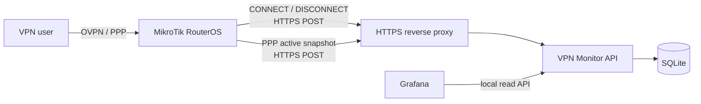

# MikroTik VPN Monitor

MikroTik VPN Monitor is a lightweight monitoring service for centralizing authenticated VPN session activity from MikroTik RouterOS and exposing it to local observability tools such as Grafana.

The project is designed around two complementary data sources:

- **PPP lifecycle events** (`on-up` / `on-down`) for durable connection history;
- **PPP active-session snapshots** for reconciliation of current state when an event is missed.

The central service will receive RouterOS data over authenticated HTTPS, persist immutable events and consolidated VPN sessions, and expose read-only query endpoints intended to remain local to the monitoring host.

## Planned architecture



The API itself is intended to bind to loopback. A reverse proxy may expose only the authenticated ingestion routes required by monitored routers, while Grafana consumes read endpoints locally.

## Design goals

- Record authenticated VPN connects and disconnects by PPP identity.
- Maintain consolidated `ACTIVE` / `CLOSED` session state.
- Reconcile missed events from periodic `/ppp active` snapshots.
- Support multiple configurable sources, such as different PPP profiles, services, or interfaces.
- Keep query endpoints local to the monitoring host.
- Use per-router credentials and idempotent ingestion.
- Remain lightweight enough for a single-host deployment.
- Keep production configuration completely outside the public repository.

## Repository status

**Architecture and implementation bootstrap.**

The first implementation target is a versioned FastAPI service with SQLAlchemy/Alembic persistence, RouterOS event and snapshot scripts, systemd deployment, tests, and Grafana integration documentation.

## Public repository boundary

This repository is intentionally public and infrastructure-agnostic.

Never commit:

- production hostnames, internal DNS names, or private/public environment addresses;
- real PPP usernames, customer/vendor identities, or organization-specific naming;
- API keys, router secrets, tokens, passwords, or hashes derived from production credentials;
- production certificates, private keys, certificate fingerprints, or CA material;
- exported RouterOS configuration containing environment-specific data;
- production Nginx configuration or firewall rules with real network ranges;
- database files, runtime state, logs, or captured VPN telemetry.

Documentation and examples must use fictitious values such as `vpn-api.example.com`, `SRV-MONITOR`, `router-01`, `vpn-user`, and documentation address ranges.

## Intended repository structure

```text
MikroTik-VPN-Monitor/
├── app/                 # FastAPI application and domain logic
├── alembic/             # Database migrations
├── deploy/              # Generic service/reverse-proxy templates
├── docs/                # Architecture, installation, RouterOS and Grafana docs
├── routeros/            # Sanitized RouterOS scripts/templates
├── scripts/             # Administrative helpers
├── tests/               # Automated tests
├── .env.example         # Placeholder-only configuration reference
└── pyproject.toml
```

## License

A project license will be added during the repository bootstrap phase.
