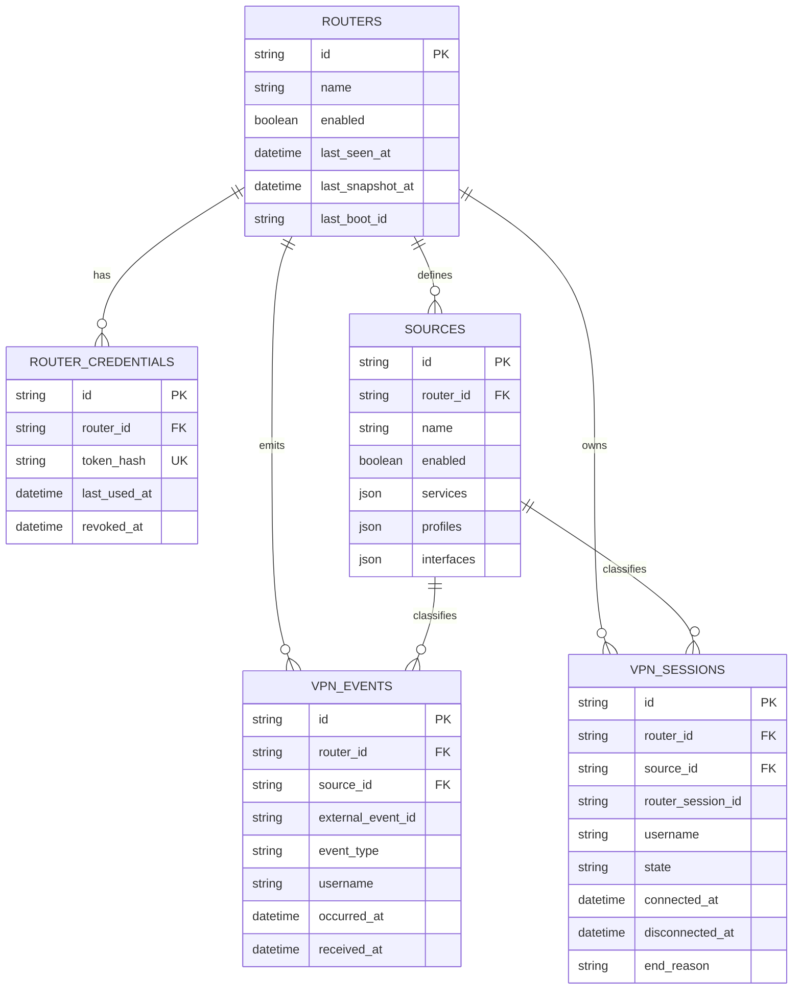

# Persistence model

This document defines the first persisted domain model for MikroTik VPN Monitor. The model is intentionally infrastructure-agnostic and supports multiple routers and multiple configurable VPN sources without coupling the service to one PPP profile.

## Goals

The persistence layer must support four concerns independently:

1. register monitored RouterOS devices without storing plaintext ingestion secrets;
2. define which PPP contexts belong to monitoring through configurable sources;
3. retain immutable lifecycle events for audit/history;
4. maintain a consolidated session projection for current-state and historical queries.

SQLite is the initial production target. SQLAlchemy and Alembic keep the schema portable enough for a future database change if the deployment grows.

## Entity relationship



## Routers

`routers` represents a monitored RouterOS device.

Operational timestamps are intentionally separate:

- `last_seen_at` tracks the most recent accepted ingestion activity;
- `last_snapshot_at` tracks the most recent successful current-state snapshot;
- `last_boot_id` is reserved for router generation/reboot correlation.

The API can disable a router without deleting its historical telemetry.

## Router credentials

`router_credentials` contains ingestion credential metadata.

Only a SHA-256 hash of a high-entropy bearer secret is persisted. Plaintext router secrets are generated/provisioned outside the database and must never be written to logs or committed to the repository.

Credential lifecycle fields support later rotation:

- `created_at`;
- `last_used_at`;
- `revoked_at`.

Authentication and rotation workflows are implemented in the next phase.

## Sources

A source is the persisted version of the source abstraction described in the system architecture.

Each source belongs to one router and has a unique `name` within that router. Selectors are stored as JSON lists:

- `services` - for example `ovpn`;
- `profiles` - one or more PPP profile names;
- `interfaces` - optional interface identifiers or patterns used by the collection contract.

An empty selector list means that dimension is not used to narrow the source. The source may be kept with `enabled=false` until a profile/interface is intentionally added to monitoring.

Example only:

```json
{
  "name": "primary-ovpn",
  "enabled": true,
  "services": ["ovpn"],
  "profiles": ["example-ovpn-profile"],
  "interfaces": []
}
```

No production profile names belong in the public repository.

## VPN events

`vpn_events` stores immutable lifecycle observations.

The database enforces uniqueness of `external_event_id` per router. This is the persistence-level foundation for idempotent event ingestion; API replay behavior is implemented separately.

Important timestamps:

- `occurred_at` - timestamp observed by RouterOS;
- `received_at` - timestamp assigned by the API.

The initial event domain is `CONNECT` and `DISCONNECT`.

## VPN sessions

`vpn_sessions` is the consolidated projection consumed by future query endpoints and Grafana.

The initial session state model is:

```text
ACTIVE -> CLOSED
```

A session can originate from:

- `EVENT` - created from a lifecycle event;
- `RECONCILIATION` - discovered from an active-session snapshot.

The schema already reserves fields needed by reconciliation and reboot handling, including `router_session_id`, `last_observed_at`, `router_boot_id`, `duration_seconds`, and `end_reason`.

## Indexing strategy

Indexes are centered on expected operational queries:

- events by router and occurrence time;
- events by source and occurrence time;
- events by router and username;
- sessions by router and state;
- sessions by source and state;
- sessions by router and connection time;
- sessions by router and username.

The model intentionally avoids premature reporting indexes until real query patterns are measured.

## Migrations

The schema is managed by Alembic.

Apply all migrations:

```bash
alembic upgrade head
```

Rollback to the pre-schema base during development/testing:

```bash
alembic downgrade base
```

Production deployment should apply migrations before the application process starts.

## Public repository boundary

Database examples and tests use only fictitious identities and documentation networks. Never commit:

- a production SQLite database;
- hashes derived from production router secrets;
- real PPP usernames or profile names;
- real caller/public addresses or VPN-assigned addresses;
- exported production telemetry.
