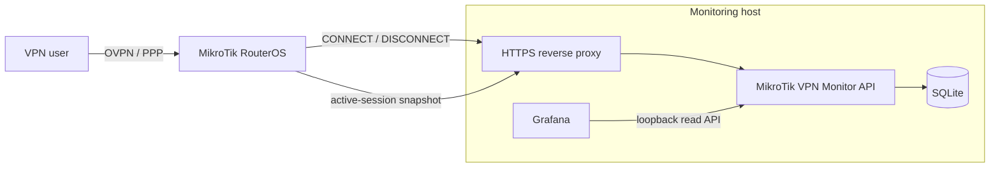
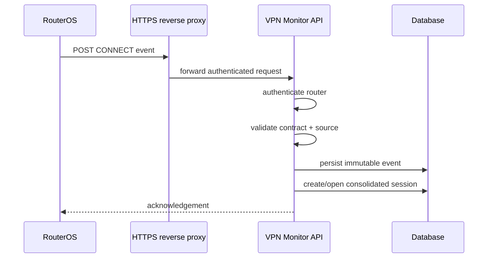
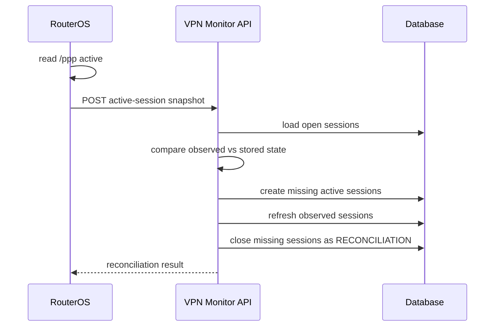
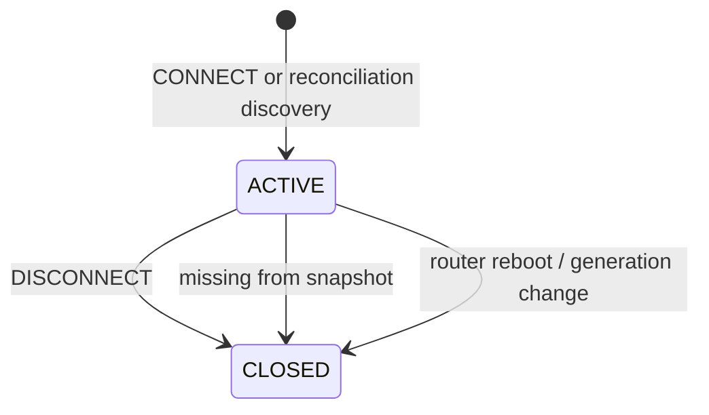

# System architecture

## 1. Purpose

MikroTik VPN Monitor centralizes authenticated VPN session activity from MikroTik RouterOS and exposes a local read API for observability tools such as Grafana.

The service is intentionally event-driven and reconciliation-aware:

- PPP `on-up` / `on-down` hooks provide lifecycle events;
- periodic `/ppp active` snapshots provide current-state reconciliation;
- immutable events are stored separately from consolidated sessions;
- read/query endpoints are intended to remain local to the monitoring host.

The design does not require an inbound management API on RouterOS. Routers initiate outbound HTTPS requests to the ingestion surface.

## 2. System context



## 3. Trust boundaries

### RouterOS -> ingestion surface

The router is allowed to send events and snapshots but must not receive query access.

Planned authentication model:

```http
X-Router-ID: <router-id>
Authorization: Bearer <router-secret>
Content-Type: application/json
```

Each router receives a unique credential. The central service stores only a one-way hash of the secret.

### Grafana -> read/query API

Grafana is expected to run on the same monitoring host and consume the API over loopback.

Read endpoints may additionally require a separate query API key. Router credentials and query credentials are deliberately independent.

### External network -> API

The application process should bind to loopback only, for example:

```text
127.0.0.1:8092
```

A reverse proxy exposes only the ingestion paths needed by RouterOS. Query endpoints are not intended to be published to the LAN or Internet.

## 4. Primary event flow

### CONNECT

When PPP authentication succeeds, RouterOS executes an `on-up` hook.



### DISCONNECT

When the authenticated PPP session ends, RouterOS executes an `on-down` hook.

The API stores the immutable event and closes the matching consolidated session with `end_reason=DISCONNECT`.

## 5. Snapshot reconciliation

Lifecycle hooks are the authoritative history source, but delivery can fail because of transient network/API outages. A periodic RouterOS scheduler therefore submits the current OVPN/PPP active-session set.



This provides eventual consistency without requiring the API to poll or administratively access the router.

## 6. Source abstraction

A **source** defines which RouterOS session context belongs to the monitoring domain. It is intentionally broader than a PPP profile.

A source may match one or more of:

- PPP profile;
- PPP service, such as `ovpn`;
- interface or interface pattern;
- future metadata used by the RouterOS scripts or API.

Conceptual configuration:

```yaml
sources:
  - id: primary-ovpn
    enabled: true
    services:
      - ovpn
    profiles:
      - example-ovpn-profile

  - id: secondary-ovpn
    enabled: false
    services:
      - ovpn
    profiles:
      - example-restricted-profile
```

The initial deployment can enable only one source while preserving a contract capable of adding additional profiles/interfaces later without redesigning the API or database.

The public repository will contain only fictitious source examples. Production source configuration remains outside version control.

## 7. Event contract

The first public contract is planned as `/api/v1`.

Example CONNECT event:

```json
{
  "contract_version": 1,
  "event_id": "example-event-id",
  "event_type": "CONNECT",
  "source_id": "primary-ovpn",
  "service": "ovpn",
  "username": "vpn-user",
  "caller_id": "203.0.113.10",
  "local_address": "10.10.0.1",
  "remote_address": "10.10.0.20",
  "interface_id": "example-interface-id",
  "occurred_at": "2026-08-24T12:00:00Z"
}
```

The corresponding DISCONNECT event uses the same contract with `event_type=DISCONNECT`.

Important properties:

- `event_id` is unique and supports idempotent ingestion;
- `occurred_at` represents router-observed time;
- `received_at` is assigned by the API;
- all persisted timestamps are normalized to UTC;
- the contract is validated before domain state changes occur.

## 8. Snapshot contract

Example active-session snapshot:

```json
{
  "contract_version": 1,
  "source_id": "primary-ovpn",
  "observed_at": "2026-08-24T12:01:00Z",
  "sessions": [
    {
      "router_session_id": "example-session-id",
      "username": "vpn-user",
      "service": "ovpn",
      "caller_id": "203.0.113.10",
      "address": "10.10.0.20",
      "uptime_seconds": 60
    }
  ]
}
```

Snapshots are current-state observations, not immutable lifecycle events. They are used to reconcile the session projection.

## 9. Planned persistence model

### routers

Represents each registered RouterOS device.

Key fields:

- `id`;
- display name;
- enabled flag;
- last seen timestamp;
- last snapshot timestamp.

### router_credentials

Stores hashed ingestion credentials and credential lifecycle metadata.

### vpn_events

Immutable lifecycle records.

Key fields:

- event UUID;
- router ID;
- external event ID/fingerprint;
- source ID;
- event type;
- username;
- service;
- caller ID;
- local/remote address;
- interface ID;
- occurred/received timestamps.

### vpn_sessions

Consolidated session projection used by dashboards and queries.

Key fields:

- session UUID;
- router ID;
- source ID;
- router session ID when available;
- username;
- service;
- state;
- caller ID;
- VPN address;
- connected/disconnected timestamps;
- duration;
- end reason.

## 10. Session state model

The initial state model is intentionally small:



Planned end reasons include:

- `DISCONNECT`;
- `RECONCILIATION`;
- `ROUTER_REBOOT`.

## 11. Idempotency

Router-side delivery may be retried. The API must therefore treat duplicate lifecycle payloads as safe replays.

The event identity/fingerprint will be unique per router. Reprocessing an already accepted event must:

- not create a second immutable event;
- not create a duplicate session;
- return a successful acknowledgement indicating a duplicate/replay where useful.

## 12. Failure behavior

### Event delivery failure

RouterOS retries a bounded number of times and records a local error if delivery continues to fail.

A later snapshot can restore current-state correctness, although a short session that occurs entirely during an API outage may not be recoverable in the first version.

### Missing DISCONNECT

The next snapshot no longer contains the session. The API closes it with `end_reason=RECONCILIATION`.

### Missing CONNECT

The snapshot contains a session unknown to the API. The API creates an active reconciled session and records that its origin was reconciliation rather than a lifecycle event.

### Router reboot

A router generation/boot identifier can be introduced in the ingestion contract to allow the API to close stale sessions from the previous generation with `end_reason=ROUTER_REBOOT`.

## 13. Planned API surface

### Ingestion

```text
POST /api/v1/router/events
POST /api/v1/router/snapshot
```

### Query

```text
GET /api/v1/routers
GET /api/v1/summary
GET /api/v1/sessions/active
GET /api/v1/sessions/history
GET /api/v1/users/{username}/history
GET /api/v1/alerts/connects
```

### Operational

```text
GET /api/v1/health
```

## 14. Deployment model

The intended single-host deployment is:

```text
RouterOS
   |
   | HTTPS POST
   v
Nginx / reverse proxy
   |
   v
127.0.0.1:8092
MikroTik VPN Monitor
   |
   +-- SQLite database
   |
   +-- local query API <-- Grafana
```

The service will be managed by systemd, use an environment file outside the Git checkout, and keep runtime data in a dedicated state directory.

## 15. Public repository boundary

The public codebase must never encode the deployment environment.

Tracked examples must use:

- fictitious router names;
- fictitious PPP profiles and users;
- `example.com` DNS names;
- documentation networks such as `192.0.2.0/24`, `198.51.100.0/24`, and `203.0.113.0/24`;
- placeholder secrets only.

Production RouterOS exports, credentials, real telemetry and environment-specific reverse-proxy/firewall configuration remain outside the repository.
